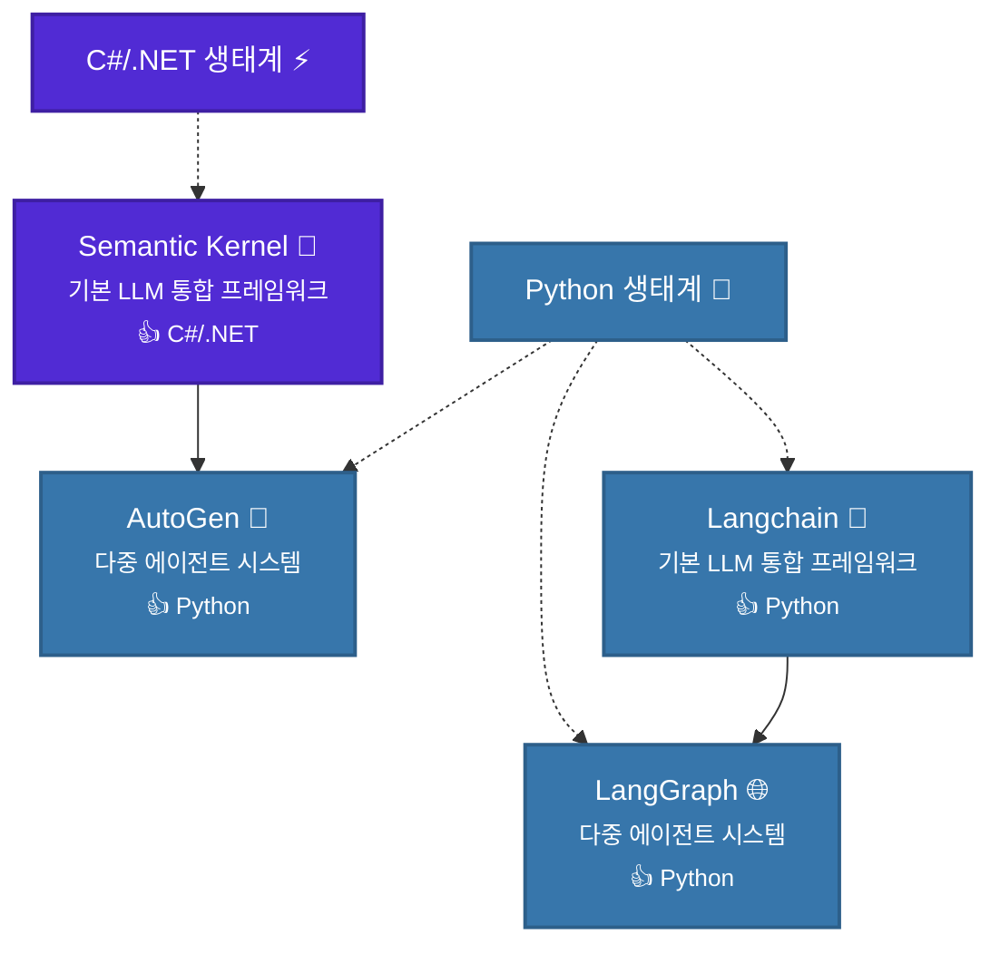

# study.langgraph
### 에이전트 프레임워크 종류
- CrewAI
  - `LangChain`으로 구축된 프레임워크
  - Agent, Tool, Task. Process, Crew로 구성
  - LangChain과 결합 용이, 멀티에이전트 아키텍처 최적화
- AutoGen
  - MS에서 구축한 멀티 에이전트 대화 시스템 구축 프레임워크
  - 사용자 대신하는 UserProxyAgent, 이를 보조하는 AssistantAgent 등 존재
  - 여러 에이전트 간의 `대화` 자체에 집중
- Langgraph
  - LangChain 생태계에서 구축된 그래프 방식의 프레임워크, Low-Level 접근
  - 에이전트-에이전트, 에이전트-도구 간의 흐름을 상세히 정의하므로 Controllability 높음
 
### LLM 프레임워크 생태계:언어별 적합성

